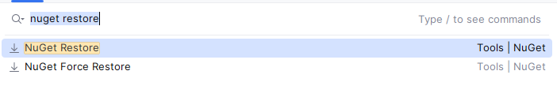

# UPack-Custom-Code-Inspection


Step 1: Add a file named **Directory.Build.props** in to root folder

YourUnityProject/
├── Assets/
├── ProjectSettings/
└── Directory.Build.props

with content
```xml
<Project>
  <ItemGroup>
    <!-- StyleCop Analyzers -->
    <PackageReference Include="StyleCop.Analyzers" Version="1.2.0-beta.556">
      <PrivateAssets>all</PrivateAssets>
      <IncludeAssets>runtime; build; native; contentfiles; analyzers</IncludeAssets>
    </PackageReference>
    
    <!-- Microsoft Code Analysis (FxCop) -->
    <PackageReference Include="Microsoft.CodeAnalysis.NetAnalyzers" Version="8.0.0">
      <PrivateAssets>all</PrivateAssets>
      <IncludeAssets>runtime; build; native; contentfiles; analyzers</IncludeAssets>
    </PackageReference>
    
    <!-- Unity-specific analyzers -->
    <PackageReference Include="Microsoft.Unity.Analyzers" Version="1.19.0">
      <PrivateAssets>all</PrivateAssets>
      <IncludeAssets>runtime; build; native; contentfiles; analyzers</IncludeAssets>
    </PackageReference>
  </ItemGroup>
</Project>
```

Step 2:
In Rider:
- Shift-Shift → Nuget Restore  

- Restart Rider


Sources:
- [Microsoft Unity Analyzer](https://github.com/microsoft/Microsoft.Unity.Analyzers)
- [UnityEngineAnalyzer](https://github.com/vad710/UnityEngineAnalyzer?tab=readme-ov-file)